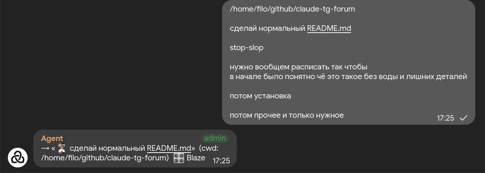
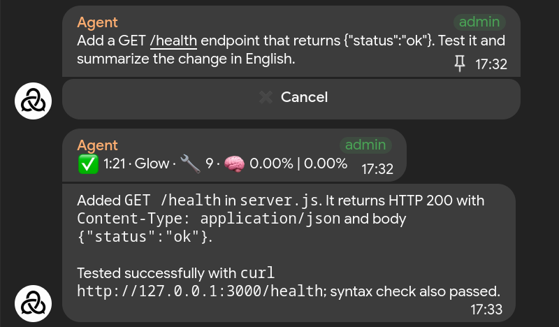

# ai-telegram-forum

Run **Claude Code, Codex, or OpenRouter agents from Telegram**. Send a task to
General, and the bot creates a topic for it. Each topic keeps its own session,
conversation history, and working directory.

The bot runs on your computer or server. Agents can work on local projects,
run commands, and send files back to the chat. You can also continue an existing
Claude Code or Codex terminal session in Telegram. Access is limited to one
Telegram user.

<p>
  
  
</p>

A demo session in Materialgram: adding and testing a health endpoint.

## Installation

### 1. Prepare the machine

You need Node.js 22 or later and credentials for at least one provider:

- **Claude Code:** install and sign in to the `claude` CLI.
- **Codex:** sign in with `codex login` (after installation, `npx codex login`
  uses the project's bundled CLI).
- **OpenRouter:** get an API key; no CLI login is needed.

Run the bot as the same OS user that owns your CLI credentials and projects.

```bash
git clone https://github.com/Filo6699/ai-telegram-forum.git
cd ai-telegram-forum
npm install
cp .env.example .env
cp config.example.json config.json
```

### 2. Set up Telegram

1. Create a bot through [@BotFather](https://t.me/BotFather) with `/newbot`.
   Save its token.
2. In BotFather, use `/setprivacy` to disable privacy mode for the bot.
3. Create a group, enable **Topics**, and add the bot as an administrator with
   **Manage Topics** permission.
4. Send a message in **General**. Before starting the bot, open this URL with
   your token substituted:

   ```text
   https://api.telegram.org/bot<TOKEN>/getUpdates
   ```

   In the response, find your message and copy `message.chat.id` (the group ID,
   usually starting with `-100`) and `message.from.id` (your user ID).

General will be the launcher for new sessions. To use a separate launcher topic,
create one, send a message there, and use its `message.message_thread_id` as
`LAUNCHER_THREAD_ID` in `config.json`.

### 3. Configure and start

Edit `.env` with your credentials and local state paths:

```dotenv
BOT_TOKEN=your-bot-token
FORUM_CHAT_ID=-1001234567890
ALLOWED_USER_ID=123456789
OPENROUTER_API_KEY=
DB_PATH=./data/state.db
PID_PATH=./data/bot.pid
```

All other bot settings live in `config.json`. Set an existing project directory
and choose `claude`, `codex`, or `openrouter`:

```json
{
  "LAUNCHER_THREAD_ID": "General",
  "DEFAULT_CWD": "/absolute/path/to/your/project",
  "PROJECTS": {},
  "PROVIDER": "claude"
}
```

For OpenRouter, set `OPENROUTER_API_KEY` in `.env` and optionally
`OPENROUTER_MODEL` in `config.json`. See [`.env.example`](./.env.example) for
local values and [`config.example.json`](./config.example.json) for portable
settings. Omitted settings use built-in defaults; a missing config file uses
those defaults too. Unknown keys and invalid values fail at startup.

Both files are loaded from this checkout, including when adoption is invoked
from another project. Both are git-ignored. Copy `config.json` to another machine
to reuse your settings; adjust absolute project paths if its directory layout
differs. JSON objects and arrays are native values, without dotenv quoting.

For an existing installation that stores all settings in `.env`, migrate once
**before** creating `config.json`:

```bash
npm run migrate-config -- --dry-run
npm run migrate-config
```

Migration preserves your local values, moves the remaining settings to JSON,
and refuses to overwrite an existing `config.json`. The old `MODEL` setting
becomes `CLAUDE_MODEL`. Restart the bot after changing configuration.

```bash
npm start
```

Send a task in General, choose the model settings, and confirm. The bot creates
a topic where you can continue the conversation. If you leave the picker alone,
it starts with the defaults after a short wait.

Keep the bot running to receive messages. For an always-on setup, run `npm start`
under your process manager with this repository as its working directory.

## Using it

Send tasks in the launcher:

```text
fix the failing login test
@myrepo add a health endpoint
/srv/app explain how authentication works
```

The first uses `DEFAULT_CWD`. The second uses an alias from `PROJECTS` in
`config.json`:

```json
{
  "PROJECTS": {"myrepo": "/home/you/projects/myrepo"}
}
```

The third uses an absolute path. The new topic remembers the directory, so you
only need the prefix when starting a session.

Within a topic, send messages, photos, or files. Images go to the agent as
images; other attachments are saved locally and passed as file paths. The agent
can send screenshots, documents, and other files back. A live status message
shows tool activity while it works.

### Commands

Commands accept typos and abbreviations: `/modee` opens `/model`, and `/usaeg`
or `/usa` runs `/usage`. Matching completes prefixes first, then chooses the
smallest edit distance (including swapped adjacent letters), with no threshold.
Ties follow the command menu order. Arguments are preserved; `/agent` remains
an alias for `/provider`. Commands addressed to another bot are ignored.
Messages and attachment captions starting with `/` are handled as commands and
never forwarded as normal agent prompts. In the launcher (new session chat),
`/path <task>` selects a working directory instead: paths containing another
slash, the root `/`, and existing directories such as `/tmp` are accepted.
This also works in attachment captions. Inside session topics, slash messages
remain commands.

- `/provider` — choose Claude, Codex, or OpenRouter for the next session.
  Existing topics keep their provider.
- `/model` — choose a model or configured preset; `/model <id>` sets one directly.
- `/effort` — choose reasoning effort; `/effort high` sets it directly.
- `/stop` — interrupt the current turn while keeping the session history.
- `/btw <question>` — ask Claude or Codex a side question without interrupting
  the main task or adding the exchange to its history.
- `/usage` — show usage and available plan limits. In the launcher, show totals
  across retained topics. Codex token counts are read from native session logs,
  including spawned agents; adopted sessions include their terminal history.
  Ephemeral Codex `/btw` forks have no persisted rollout and are excluded from
  the native log totals.
  Plan limits come directly from the account and include usage outside Telegram.
  The `≈` allowance percentages in Codex turn summaries use an estimated weekly
  capacity of 8,500 credits, not an official conversion for every plan. Credit
  rates alone do not determine included subscription usage. The summary shows
  this turn, then the full session history, which can span several reset windows.
- `/resume` — get the command to continue a Claude or Codex session in a terminal.
- `/id` — show the session ID.
- `/progress off|brief|detailed` — set progress messages. In the launcher,
  this is the persistent default for new sessions; inside a topic, it changes
  only that topic.
- `/toolcalls off|only_file_edits|full` — control separate tool-call messages.
  Messages show a short command or path instead of the full tool input.

Model and effort changes apply from the next turn and persist in that topic.
In the launcher, they apply only to the next session. Use `/model default` or
`/effort default` to reset them. Progress defaults to `off`; its launcher
setting is stored across restarts. Tool-call messages also default to `off`,
and the live status message still appears.

### Continue a terminal session in Telegram

With the bot running, install the integration once from this repository:

```bash
npm run install-command
```

Then invoke it inside the terminal session you want to move:

```text
Claude Code: /telegramify
Codex:       $telegramify
```

It returns a topic link. Continue there with the same session and history.
Don't use the same session in the terminal and Telegram at the same time: both
write to the same transcript. Calling the integration again returns the existing
topic.

You can also select a session from the shell:

```bash
npm run telegramify -- --provider claude --session <session-id>
npm run telegramify -- --provider codex --session <session-id>
```

### Model presets

Defaults and optional picker presets live in `config.json`:
`CLAUDE_MODEL`, `CODEX_MODEL`, `CODEX_PRESETS`, `CODEX_DEFAULT_PRESET`,
`OPENROUTER_MODEL`, and `OPENROUTER_PRESETS`.
When starting a Codex or OpenRouter session, the configured Codex presets and
OpenRouter presets appear in one picker. Choosing `Free` or `Deepseek` switches
that new topic to OpenRouter automatically. Add native JSON objects, for example:

```json
{
  "CODEX_PRESETS": {
    "Decent": {"model": "gpt-5.6-sol", "effort": "high"},
    "Quick": {"model": "gpt-5.6-sol", "effort": "low", "fast": true}
  },
  "CODEX_DEFAULT_PRESET": "Decent",
  "OPENROUTER_PRESETS": {
    "Free": {"model": "openrouter/free"}
  }
}
```

Codex presets support `serviceTier` (`default` or `fast`) and `light` as an alias
for `low` effort. Without presets, the picker shows separate model and effort
grids. Optional `CODEX_EFFORT` sets the default effort before falling back to
Codex's native configuration. OpenRouter presets also support `temperature`,
`max_tokens`, `reasoning`, `provider`, and up to three `fallbacks` model IDs.
OpenRouter appears only when its API key is configured in `.env`.

## Permissions and stored data

**Agents can edit files and run shell commands on the host machine.** Keep
`.env` private and run the bot under an OS account with access only to the
projects it needs.

`"PERMISSION": "auto"` in `config.json` is the default:

- Claude and OpenRouter auto-approve tools listed in `ALLOWED_TOOLS` and ask for
  other tools in Telegram. Recognized destructive shell commands also require
  approval. Unanswered prompts expire after 10 minutes by default.
- Codex uses a `workspace-write` sandbox with network access. It cannot ask for
  interactive approval through Telegram; blocked operations return errors.

`"PERMISSION": "bypass"` removes these approval checks and gives Codex full filesystem
access. Even in `auto`, the default tool list allows file edits and shell commands.

Idle topics are deleted after **7 days** by default (`"DELETE_AFTER_HOURS": 168`).
Set `"DELETE_AFTER_HOURS": 0` in `config.json` and restart the bot to disable automatic
topic deletion. When enabled, deletion removes
the Telegram topic and its database entry, but keeps agent transcripts and
attachments on disk. Claude and Codex sessions remain resumable from the terminal.

Bot state and attachments are stored under `data/` by default. Claude and Codex
keep their native session history; OpenRouter history defaults to
`data/openrouter-sessions/`.

## Development

```bash
npm run dev        # restart on source changes
npm run typecheck  # check TypeScript
npm test           # run tests
```

See [docs/architecture.md](./docs/architecture.md) for module boundaries and
[AGENTS.md](./AGENTS.md) for contribution rules.

## License

[MIT](./LICENSE)
